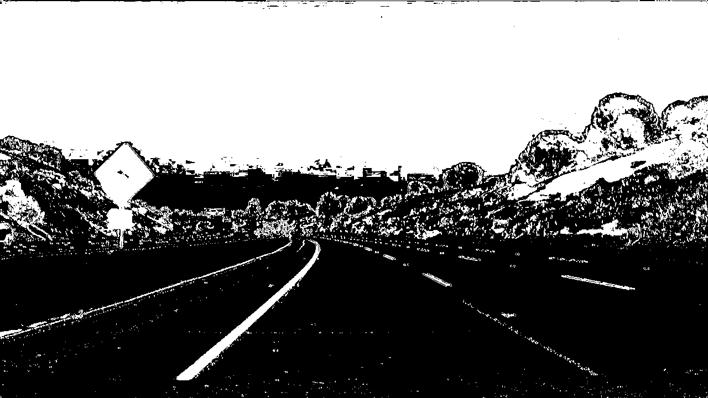
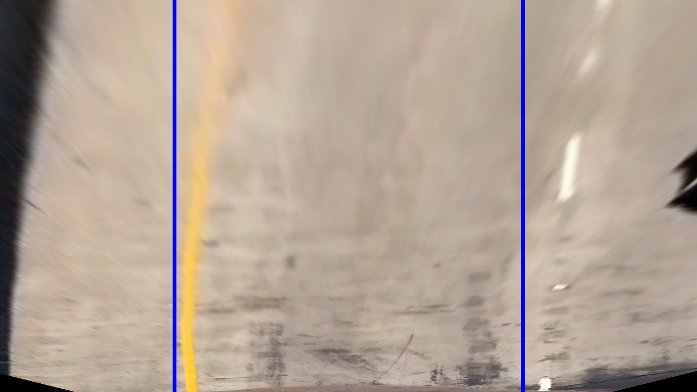
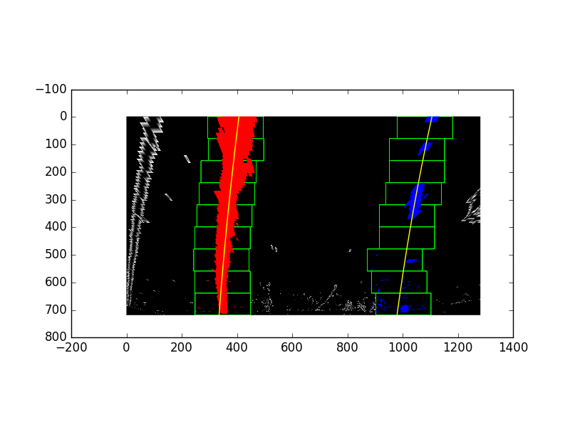
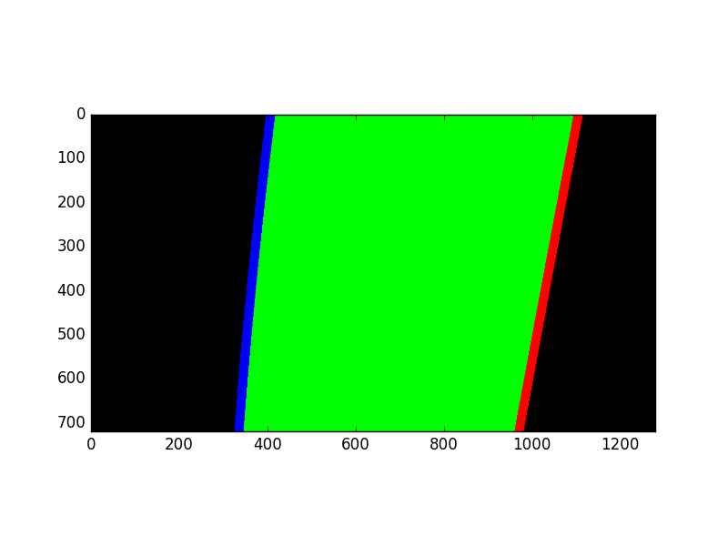
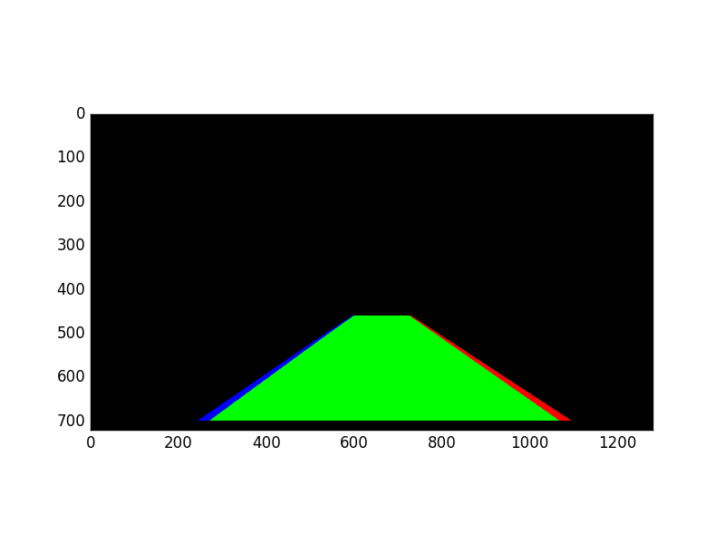
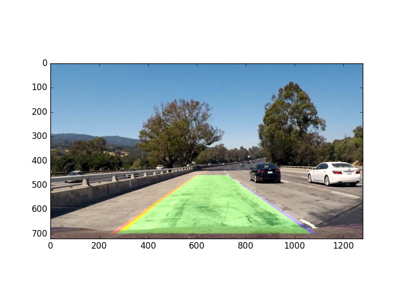
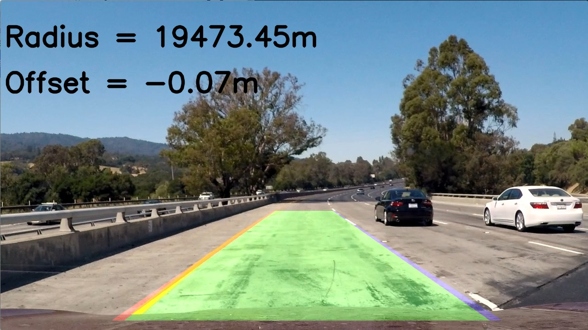

#Advanced Lane Finding
Neil Maude, February 2017
##Overview
This document describes the steps and processes used in the Advanced Lane Lines finding project.

Video files available at: https://drive.google.com/open?id=0B2aeNxAHccrqYk5VTGE3dkpWOHM

The objectives of this project are:

1. Compute the camera calibration matrix and distortion coefficients to correct perspective for the camera used to generate the project data.
2. Apply this correction to raw test images.
3. Use colour transforms and gradient thresolding to create thresholded binary images.
4. Use perspective transformation to transform a forward-facing camera view into a top-down/overhead view of the road.
5. Detect lane line pixels and use polynomial fitting to find the lane boundaries.
6. Create a representation of the lane from the overhead view and translate this back to the forward-facing perspective.
7. Overlay the lane representation onto the original view.
8. Create a pipeline to apply this process to a video stream.

The program code is contained in the following files:

1. **advanced_lane_lines.py** - this file contains the main functions used in the imaging pipeline
2. **advanced_lane_lines_tests.py** - this file contains test functions used to check the functionality of each of the pipeline components. This file also contains the call to the camera calibration functions to create  calibration data from the supplied chessboard images.
3. **advanced_lane_lines_pipeline.py** - this file contains the image processing pipeline and code to process the project video file.

##Camera calibration
The camera calibration process is in the **advanced_lane_lines.py** file, lines 54-145.

The process is as follows:

1. Take as input a directory of sample images and an original chessboard pattern/reference image.  (Note that the number of squares in the reference image is defaulted for this project to 9 * 6, but can be any reasonable size.)
2. Create default "object points" which are the reference locations of the chessboard corners in object space.
3. For each example image, load the image and run the cv2.findChessboardCorners() function to locate points ("image points") within the image.
4. For each image, the object points and image points are recorded.
5. The full array of object and image points are then passed to the cv2.calibrateCamera() function, which returns the calibration matrix (mtx) and distortion coefficients (dist) which can be used to correct the perspective of an image taken with this camera.
6. The mtx and dist values are then saved for use when processing images for this camera, allowing correction via the cv2.undistort() function.

To illustrate the process, the **calibrate_camera** function outputs a perspective-corrected example of each input image (if run in "verbose" mode).

The following shows an original (distorted/uncorrected image):


The following shows the corners located in that image:


The following is the final distortion-corrected image, after applying the undistort() function:


The lens distortion evident in the original image (e.g. the curve of the top line) has been removed in the corrected image.

##Apply Correction to Raw Images
By reloading the calibration data and applying the advanced_lane_lines.undistort() function (**advanced_lane_lines.py**, lines 159-162), individual images can have distortion corrected.

The following is an original image:


The undistorted image is:


Note how the signpost appears more square-on in the second image and some scenery has been translated to the right hand side of the image.

This correction process is essential to provide a real-world view which is independent of any image distortion by the camera lens and therefore suitable for use when calculating the location of objects relative to the vehicle.

##Creating a Thresholded Binary Image
Applying thresholding functions to the corrected image can be used to generate a binary thresholded image, showing candidate pixels for lane-finding.

A number of translations are implemented in the **advanced_lane_lines.py** file:

1. Sobel absolute thresholding - sobel_abs_thresh(), lines 172-193
2. Sobel magnitude thresholding - sobel_mag_thresh(), lines 196-212
3. Sobel directional thresholding - sobel_dir_thresh(), lines 215-231
4. HLS S-channel thresholding - hls_s_channel(), lines 234-246

In addition, helper functions are provided to combine two masks into a single image - combine_mask(), lines 249-254 - and to convert the mask into a thresholded binary image - mask2binary(), lines 166-169.

Finall,y, a set of preferred thresholding functions are provided in a single function preferred_threshold(), lines 257-264.  This function is intended to be called from a video processing pipeline and is a short-cut to the preferred set of filters.

The preferred set of filters is a combination of:

1. HLS S-channel thresholding
2. Sobel absolute thresolding

This leads to images similar to the following:



(This is the thresholded version of the undistorted example image shown previously.)

The choice of filters is a tune-able element of the pipeline and many other options/combinations are available.  This choice appears to work well on the project example video.  The key point is that pixels from the lane lines are being isolated by the chosen thresholding filters.

##Transforming to an Overhead View
The next step is to transform the forward-facing camera view to a top-down view of the area of interest for lane lines. 

The following source and destination area co-ordinates were used:
```
SOURCE_AREA = np.float32([[235, 700], [580, 460], [700, 460], [1070, 700]])  
DEST_AREA = np.float32([[320, 720], [320, 0], [960, 0], [960, 720]])  
```
These co-ordinates translate an area roughly corresponding to lanes in the middle field of view into a top-down view of those lanes.  This is done by the warp_image() function (lines 272-281, **advanced_lane_lines.py**).

The following is a transformed section of an original image:


(The blue lines are drawn to provide a reference point to judge of the translated lines are parallel, although this is of less practical value in this image where the original lane lines are not straight.)

Note that this example is provided to show the effect of the overall transformation process, but the binary threshold images will be transformed for lane finding.

##Detecting Lane Lines
Lane lines can be detected by looking for lane patterns in a transformed binary threshold image.

This is done by the following functions in **advanced_lane_lines.py**:

1. find_lanes_sliding(), lines 296-370 - this function uses a sliding windows process to locate lane lines, as provided in the lectures.  This function applies a histogram function across the image to find the peaks of highest brightness and uses these locations as lane lines.  
2. find_lanes_search(), lines 373-393 - this function is a faster process to locate lane lines, by assuming that the lane will be close to a line found by the find_lanes_sliding() process (again, this function is from the lectures).

The combination of sliding-windows and searching is discussed in a separate section later in this document.

Applying the find_lanes_sliding() function to a transformed binary thresholded image produces the following lane location:



The red pixels represent those found for the left lane, blue for the right and the yellow lines represent the fitted polynomial for each lane line.

##Representing the Lane
Once a polynominal has been fitted to each line, a representation of the lane can be created on a fresh image canvas, using the plot_lanes_on_warped() function (**advanced_lane_lines.py**, lines 395-417:



This image can then be transformed back to the front-view perspective using the warp_overhead_to_original() function (this function simply calls the warp_image() function with the source and destination co-ordinates reversed, to invert the original transformation process).



This image represents the lanes found in an input image and can be merged with the original.

##Merging Images
The original and lanes images are merged using the merge_over_camera_view() function (**advanced_lane_lines.py**, lines 419-422) which adds a weighted copy of the lanes image over the original image.

This creates a view of the image similar to:



##Radius and offset
As a final step, the radius of curvature of the lane and the offset of the car from the lane centre are calculated, using the following functions (in **advanced__lane_lines.py**):

1. get_curvature(), lines 427-441 - this calculation uses the pixels located for the lane to fit a polynomial **after** a co-ordinate transformation to meters and provides curvatures of the left/right lanes.  An average of the two is used for display, whilst the left/right radii are used for checking if the lane finding was accurate (as discussed in the pipeline section).
2. get_offset(), lines 444-458 - this calculation uses the left/right line fits to determine the base position of the left/right lane lines and how far the centre of the car is from these lanes.  The value will be positive if the car is to the right of centre and negative if to the left.

These values will be plotted on frames in the video during pipeline processing.



Note: this final image shows a very large radius (over 19km!), as the lane is near straight in the example image.

##Creating the Pipeline
The imaging pipeline brings together these processing functions in one function which can be applied to individual video frames.  This is provided in the process_image() function in the **advanced_lane_lines_pipeline.py** file.  

This pipeline does the following (numbering corresponds to comments in the code):

0. Load in previously created camera calibration data (line 32).
1. Removes image distortion (line 48)
2. Creates a binary thresholded image, using the preferred thresholding provided previously (line 51)
3. Finds the lane lines (lines 57-118).  This process uses the sliding windows technique to find an initial fit, then the more efficient search approach thereafter (provided a good line fit is found).
4. As part of the line-fitting, the radius and offset values are calculated (this is convenient, as the pixels lists are used).
5. The lane lines and zone are drawn on a new image and merged over the input image.
6. The radius and curvature are drawn on the image.  Note that this is only updated with a new value every 10th image (or as set by UPDATE_TEXT_INTERVAL), in order that the text is readable in the video (updating every frame would mean that the text flickers too quickly to read).

The process_image() function returns the final annotated image, which can be pasted into the video stream.

The **advanced_lanes_pipeline.py** file also runs the processing pipeline on each of the project videos.

###Sliding Windows vs Search
The sliding windows approach is more expensive than searching around an existing line, hence the search option is used for preference when lines have already been found.  However, it may be the case that the lines can't be found accurately by the search process and in which case the process will fall back to the sliding windows approach.

A "good" fit is determined by the check_similar_radii() function (**advanced_lane_lines.py, lines 468-475), which checks whether the radius of the two lane lines is similar (within a percentage set by MAX_RADIUS_DIFFERENCE).  If the difference between the lane lines exceeds that threshold, the current fit is rejected.

###Dealing with Errors/Lane Not Found
If the current lane fit can't be found with either the search (if a previous fit exists) or resorting to sliding windows, the process_image() function uses a weighted average of previous frame fits to infer a best guess at that point.  

See **advanced_lane_lines_pipeline.py**, lines 97-115.  A weighted average is calculated for the polynomial coefficients of the left and right lane lines and this is used to create a polynomial for that video frame. 

Note that more recent frames are given a higher weighting, as per the values in SMOOTHING_WEIGHTS.

This smoothing process improves the accuracy of lane finding when the roadway surface changes and the binary thresholding no longer gives a good set of pixels for lane finding - for example in the case of the two lighter areas of roadway in the project video.

##Final output
The final output is shown in [Final Output Video](./outputs/project_video_output.mp4).

This video shows the output of running the pipeline on the project video.  

##Reflections on the Challenge Videos
The pipeline performs well on the project video, but does not do well on the two challenge videos.  In the "challenge" video ([Challenge Output Video](./outputs/challenge_video_output.mp4) ), the presence of non-lane markings near to the lane markings (e.g. joints in the concrete) confuses the lane finding, leading to inaccurate lane positioninng.  In the "harder" video (no example - not worthy of inclusion), the extreme curvature of lanes leads to the lane edges not being detected at all (especially when not present in the field of view).

The non-lane features could be addressed by tuning the colour selection process in the binary thresholding to use channels which remove the (predominantly gray) non-lane features and prefer the coloured lane features.  It would likely be possible to use more than one binary thresold and use a voting method to take the best/most likely lanes (i.e. those with similar radii and a constant lane-width in the top-down view).

Further tuning of the thresholding could also address the varying lighting conditions which cause issues in the challenge videos.

The "harder" video demonstrates issues of reflectivity on the wind-screen, which makes the image difficult to process (and likely difficult driving conditions for the human driver).  This would be reduced in the case of external (bumper) cameras in a practical application (i.e. cameras in the car bumper rather than test cameras mounted on a bracket by the rear-view mirror). Further, the "harder" video suggests that a wider camera view would be an advantage, to capture the extents of the lane in the case of extreme curves.

To address the extreme curves using only the view provided would require some assumptions of curvature of the second (non-visible) lane from the lane which is visible.  
